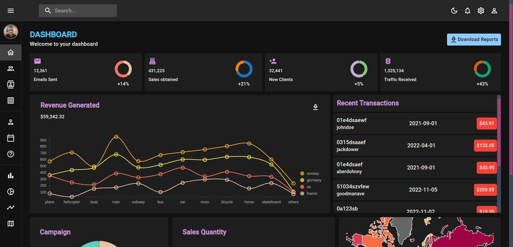

# React Dashboard

This project is a responsive and customizable dashboard built with React. It provides a clean and modern interface for managing and visualizing data.

## Features

- Responsive design
- Customizable widgets
- Data visualization with charts
- User authentication
- Dark and light mode

## Screenshots



## Installation

1. Clone the repository:
  ```bash
  git clone https://github.com/Mohamad-Shiro/React-Dashboard
  ```
2. Navigate to the project directory:
  ```bash
  cd react-dashboard
  ```
3. Install dependencies:
  ```bash
  npm install
  ```
4. Start the development server:
  ```bash
  npm start
  ```

## Usage

After starting the development server, open your browser and navigate to `http://localhost:3000` to view the dashboard.


## License

This project is licensed under the MIT License. See the [LICENSE](LICENSE) file for details.

## Contact

For any questions or feedback, please contact:
  - Email: mohamad.shiro80026@gmail.com
  - LinkedIn: [Mohamad Ashraf](https://www.linkedin.com/in/mohamad-ashraf-mahmoud/)